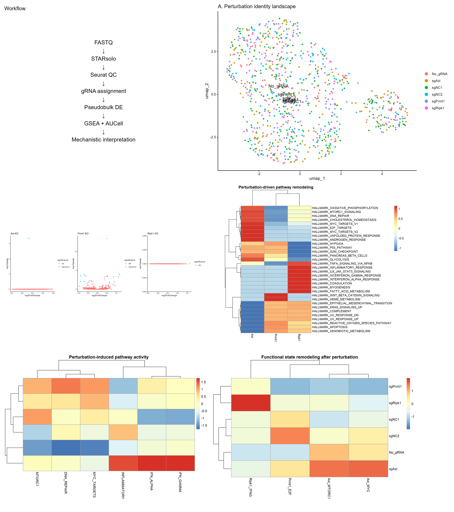
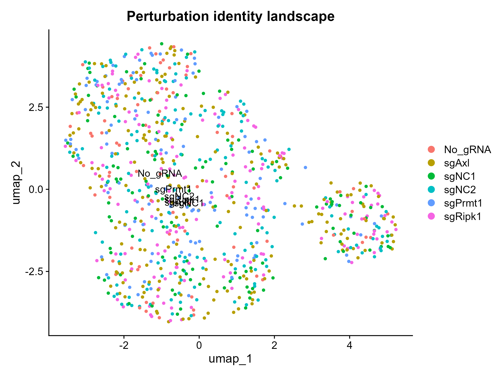
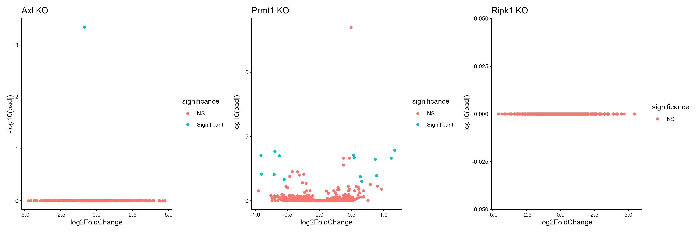
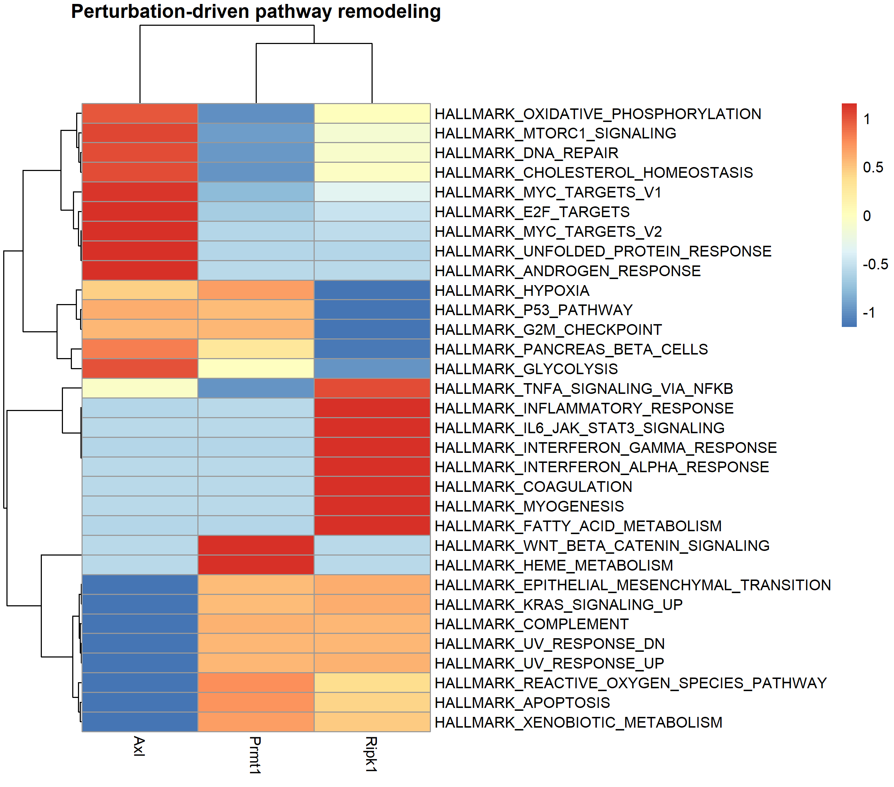
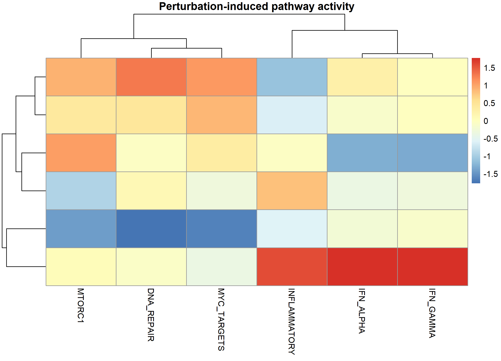
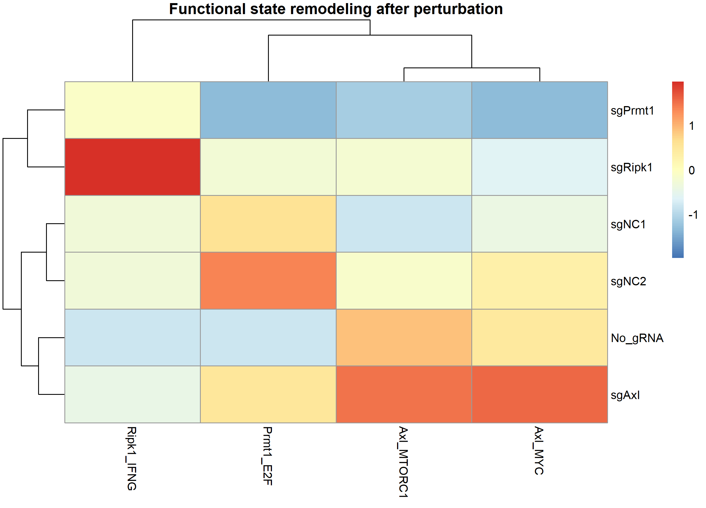

# Single-cell Perturb-seq Analysis Reveals Perturbation-specific Transcriptional Programs

## Project Overview

This project presents an end-to-end single-cell Perturb-seq analysis workflow to investigate how CRISPR-mediated genetic perturbations reshape transcriptional states at single-cell resolution.

The analysis integrates:

- STARsolo preprocessing
- Seurat-based single-cell analysis
- gRNA identity assignment
- pseudobulk differential expression
- pathway enrichment analysis
- Hallmark GSEA
- AUCell pathway activity scoring
- mechanistic interpretation of perturbation effects

## Project Highlights

✔ End-to-end Perturb-seq analysis workflow

✔ STARsolo-based single-cell preprocessing

✔ Seurat-based QC, clustering and visualization

✔ CRISPR perturbation identity assignment

✔ Pseudobulk differential expression analysis

✔ Hallmark pathway GSEA

✔ AUCell single-cell pathway activity scoring

✔ Mechanistic interpretation of perturbation-specific states

## Table of Contents

- [Project Overview](#project-overview)
- [Dataset](#dataset)
- [Analysis Workflow](#analysis-workflow)
- [Major Findings](#major-findings)
- [Repository Structure](#repository-structure)
- [Methods](#methods)
- [Results](#results)
- [Reproducibility](#reproducibility)

Research question:

**How do genetic perturbations reshape cellular states and transcriptional programs at single-cell resolution?**

## Computational workflow

## Dataset

Organism:
Mus musculus

Technology:
Single-cell RNA sequencing with CRISPR perturbation information

Processed samples:

- SRR19654344
- SRR19654345
- SRR19654346
- SRR19654347

Final analyzed dataset:

- Cells: 878
- Genes: 19,641
- Perturbations:
    - sgAxl
    - sgPrmt1
    - sgRipk1
    - sgNC1
    - sgNC2

## Analysis Workflow

FASTQ

↓

STARsolo alignment

↓

Gene expression matrix + CRISPR guide information

↓

Seurat object generation

↓

Quality control and normalization

↓

PCA and UMAP visualization

↓

gRNA assignment validation

↓

Perturbation-specific pseudobulk differential expression

↓

GO enrichment and Hallmark GSEA

↓

AUCell pathway activity scoring

↓

Mechanistic interpretation

## Major Findings

The integrated analysis identified distinct transcriptional states induced by different genetic perturbations.

### Axl perturbation

Associated with:

- MYC target activation
- mTORC1 signaling
- DNA repair programs

### Prmt1 perturbation

Associated with:

- Suppression of MYC/E2F-associated programs
- Oxidative stress response
- Hypoxia-related transcriptional changes

### Ripk1 perturbation

Associated with:

- Interferon alpha response
- Interferon gamma response
- Inflammatory signaling activation

Together, these results demonstrate perturbation-specific remodeling of cellular transcriptional states.

## Repository Structure
├── scripts/
│ └── Analysis scripts
│
├── results/
│ ├── QC
│ ├── Differential_expression
│ ├── GO_enrichment
│ ├── GSEA
│ ├── Signature_scoring
│ └── Figures
│
├── objects/
│ └── Seurat objects
│
└── documentation/
├── Methods.md
├── Biological_summary.md
└── Figures_description.md

## Tools

- STARsolo
- Seurat
- R
- ggplot2
- PCA
- UMAP
- Louvain clustering

Additional analysis tools:

- DESeq2
- clusterProfiler
- enrichplot
- AUCell
- pheatmap
- patchwork

# Key Results

## 1. Single-cell Perturbation Landscape

UMAP visualization of cells colored by CRISPR perturbation identity.

## 2. Differential Expression Analysis

Pseudobulk DESeq2 analysis identified perturbation-specific transcriptional changes.

## 3. Pathway Remodeling

Hallmark GSEA revealed distinct pathway programs activated by each perturbation.

## 4. Single-cell Signature Activity

AUCell scoring was used to quantify pathway activity at single-cell resolution.

## 5. Mechanistic Interpretation

Integrated signature analysis summarizes perturbation-induced cellular state changes.

## Key Biological Observations

PCA and UMAP analysis revealed distinct transcriptional states among cancer cells.

Major transcriptional programs identified included:

- interferon response signatures
- proliferation-associated states
- extracellular matrix associated programs
- stress-response signatures

Cluster-specific marker analysis was performed using FindAllMarkers().

## Single-cell analysis

Cells retained:

878 cells

Genes detected:

19,641

## Analysis Summary

Raw sequencing data were processed using STARsolo 
to generate a cell-by-gene expression matrix.

The dataset was evaluated through:

- sequencing quality assessment
- barcode/UMI structure inspection
- gene expression quantification
- single-cell quality control
- normalization
- highly variable gene selection
- PCA-based dimensionality reduction
- UMAP visualization
- graph-based clustering
- marker gene identification

Final dataset:

Cells analyzed: 878

Genes detected: 19,641

Clusters identified: 4

Resolution:
0.5

Dimensionality:
20 PCs

Generated outputs:

- QC visualization
- PCA analysis
- UMAP clustering
- Cluster marker identification

## Important note

Although the dataset was originally associated with CRISPR perturbation experiments, the processed STARsolo feature matrix contained only:

Gene Expression

No CRISPR Guide Capture features were detected.

Therefore, direct guide RNA assignment was not performed in this dataset.

Future work:

A Perturb-seq dataset containing guide RNA capture features will be integrated for:

- gRNA assignment
- perturbation labeling
- perturbation-specific differential expression
- pathway analysis
## Dataset Information

Dataset:
Single-cell CRISPR immune screens reveal immunological roles of tumor intrinsic factors

Organism:
Mus musculus

Platform:
Illumina sequencing

Data type:
Single-cell RNA sequencing with CRISPR perturbation information

Samples analyzed:
- SRR19654344
- SRR19654345
- SRR19654346
- SRR19654347

## Reproducibility

All analysis scripts, processed objects, and result files are provided.

Main computational tools:

- STARsolo
- Seurat
- DESeq2
- clusterProfiler
- AUCell
- ggplot2

Detailed methodology is available in:

[Methods](documentation/Methods.md)

Biological interpretation:

[Biological Summary](documentation/Biological_summary.md)

Figure descriptions:

[Figures Description](documentation/Figures_description.md)
